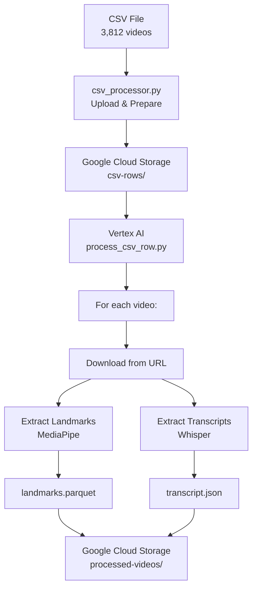

# Cloud Processing for Sign Language Videos

This directory contains the cloud processing pipeline for extracting landmarks and transcripts from Tagesschau sign language videos. The pipeline processes videos directly from URLs in a CSV file using Google Cloud Vertex AI.

## 📁 Directory Structure

```
cloud-processing/
├── README.md                          # This documentation
├── process_tagesschau_videos.ipynb    # 🎯 MAIN NOTEBOOK - Start here
├── process_csv_row.py                 # Core processing function for individual videos
├── csv_processor.py                   # CSV file handling and batch preparation
├── fix_json_files.py                  # Utility to fix JSON files with NaN values
├── filter_landmarks.py               # Optional: Filter landmarks for specific features
```

## 🚀 Quick Start

### 1. **Main Entry Point**

Start with `process_tagesschau_videos.ipynb` - this is the primary notebook for processing videos from the CSV file.

### 2. **Prerequisites**

- Google Cloud Project configured with Vertex AI
- Configuration file: `models/vertex_ai/config/dev.yaml`
- CSV file: `../tagesschau_sign_language_video_links.csv` (3,812 videos)

### 3. **Processing Workflow**

1. **Upload CSV**: Converts CSV to individual JSON files for batch processing
2. **Submit Job**: Runs cloud processing across multiple machines
3. **Monitor**: Track progress via Vertex AI console
4. **Results**: Landmark and transcript files saved to Google Cloud Storage

## 📋 File Descriptions

### **Active Files** ✅

#### `process_tagesschau_videos.ipynb`

**Primary notebook for processing Tagesschau videos from CSV URLs**

- Uploads CSV file to Google Cloud Storage
- Creates batch processing jobs
- Monitors progress and results
- Includes test mode for small-scale testing

#### `process_csv_row.py`

**Core processing function executed on cloud machines**

- Downloads videos from Tagesschau URLs
- Extracts MediaPipe landmarks (pose, face, hands)
- Extracts German transcripts using Whisper
- Saves results as `.parquet` and `.json` files

**Function signature:**

```python
def process_csv_row(input_path: str, temp_dir: str) -> str
```

#### `csv_processor.py`

**Helper functions for CSV file handling**

- `upload_csv_and_prepare_batch_data()`: Uploads CSV and creates batch files
- `list_csv_rows()`: Lists available CSV row files
- Handles NaN values properly (converts to JSON null)

#### `fix_json_files.py`

**Utility to fix JSON files with NaN values**

- Fixes existing JSON files that have invalid NaN values
- Replaces NaN with proper JSON null values
- Includes verification functions

#### `filter_landmarks.py`

**Optional landmark filtering utility**

- Filters landmarks to include only specific facial features
- Includes predefined sets for silhouette, eyes, lips, nose, etc.
- Can be used for feature selection after processing

## 🎯 Data Flow



## 📊 Output Files

For each processed video, the pipeline generates:

### Landmarks (`{video_id}_landmarks.parquet`)

- MediaPipe pose, face, and hand landmarks
- Frame-by-frame data with x,y,z coordinates and visibility
- Columns: `frame`, `pose-{0-32}-{x,y,z,visibility}`, `face-{0-467}-{x,y,z,visibility}`, etc.

### Transcripts (`{video_id}_transcript.json`)

- German transcription with word-level timestamps
- Generated using OpenAI Whisper large-v3 model
- Format: List of segments with start/end times and text

## 🔧 Configuration

### Machine Configuration

- **Machine Type**: `n1-standard-8` (8 vCPUs, 30GB RAM)
- **Disk**: 200GB (for video downloads)
- **Provisioning**: SPOT instances for cost savings
- **Timeout**: 7 days for large batch processing

### Requirements

```python
requirements = [
    "mediapipe",
    "opencv-python",
    "pandas",
    "natsort",
    "openai-whisper",
    "ffmpeg-python",
    "requests"
]
```

## 📈 Monitoring & Results

### Progress Monitoring

- **Vertex AI Console**: `https://console.cloud.google.com/vertex-ai/training`
- **Job States**: PENDING → QUEUED → RUNNING → SUCCEEDED
- **Progress Tracking**: Built-in progress bars and status updates

### Results Location

```
gs://sign-lang-translator-20241029-dev-data/
├── raw-data/tagesschau_sign_language_video_links.csv
├── csv-rows/row_*.json
└── processed-videos/
    ├── {video_id}_landmarks.parquet
    └── {video_id}_transcript.json
```

## 🧪 Testing

### Test Mode

Set `TEST_MODE = True` in the notebook to:

- Process only a subset of videos
- Use fewer workers (2 instead of 10)
- Faster feedback for testing

### Verification

```python
# Check if JSON files are valid
verify_json_files(config.project_id, config.environment)

# Check processing results
check_results()  # Shows count of processed files
```

## 🚨 Troubleshooting

### Common Issues

1. **JSON Parse Errors**:

   - Run `fix_json_files.py` to fix NaN values
   - Ensure CSV has been properly uploaded

2. **Job Fails**:

   - Check Vertex AI console for error logs
   - Verify video URLs are accessible
   - Check disk space and timeout settings

3. **No Files Found**:
   - Ensure CSV file path is correct
   - Check that `upload_csv_and_prepare_batch_data()` completed successfully
   - Verify bucket permissions

### Error Recovery

- Jobs auto-restart on failure (`restart_on_failure=True`)
- Use SPOT instances with automatic preemption handling
- Individual video failures don't stop the entire batch

## 💰 Cost Optimization

- **SPOT Instances**: 60-80% cost savings vs regular instances
- **Parallel Processing**: Multiple workers reduce total runtime
- **Efficient Storage**: Parquet format for compressed landmark data
- **Batch Processing**: Minimizes overhead per video

## 🔄 Next Steps

After processing completes, you can:

1. **Filter Landmarks**: Use `filter_landmarks.py` for feature selection
2. **Training Data**: Combine landmarks + transcripts for ML training
3. **Analysis**: Explore processed data for insights
4. **Model Training**: Use the data for sign language translation models

---

**Last Updated**: December 2024  
**Author**: AI Assistant  
**Project**: Sign Language Translator
